# Full-Duplex Dialogue Data Preparation

A reproducible pipeline for synthesizing **full-duplex** multi-round dialogue
data for SFT, where the assistant must learn when to **start speaking**,
**continue speaking** through a barge-in, and **switch to listening** when
the user actually interrupts.

The data design follows the paper
**"OpenSpeechLM: A Full-Duplex Speech Language Model"**
([arXiv:2502.14145](https://arxiv.org/pdf/2502.14145)), section on data construction.

> **TL;DR.** Generate bilingual (EN/ZH) multi-round dialogues with an LLM,
> filter / clean them, then probabilistically rewrite a fraction of the rounds
> as **real** or **fake** interruptions, **plus** split some user turns with
> a `<|continue-listen|>` mid-utterance marker. Insert the four control tokens
> `<|switch-to-speak|>`, `<|switch-to-listen|>`, `<|continue_speak|>`,
> `<|continue-listen|>`. The output is JSONL ready for SFT, in either
> standard OpenAI `messages` format or the HY YiZhangShi (腾讯混元一站式)
> `{input, output}` `[CHAT_SEP]` format actually used to train the paper's model.

> **A note on timing and LLM choice.** This implementation was built in
> **early 2024**. Since then the instruction-following ability and overall
> quality of frontier LLMs has improved substantially, so the prompts shipped
> here may need slight modernization (clearer JSON schema instructions,
> stronger few-shot examples, structured-output mode where available) to
> get the best results from newer models. The pipeline itself is
> **model-agnostic**: in the original work we called **OpenAI GPT-4o** and
> **ByteDance Doubao Pro 32k**, but the LLM caller in
> [`scripts/01_call_llm.py`](fullduplex_dialogue_data/scripts/01_call_llm.py)
> uses a generic OpenAI-compatible client, so you are free to swap in
> Claude, Gemini, DeepSeek, Qwen, Mistral, a local vLLM endpoint, or any
> other provider you prefer simply by setting `LLM_BASE_URL` and `LLM_MODEL`
> in your `.env`.

---

## 1. Control-token vocabulary

Four tokens describe the assistant's state transitions, plus one internal
marker:

| Token | Role |
| --- | --- |
| `<\|switch-to-speak\|>` | **Start speaking** -- begin an assistant turn (normal QA, or new reply after a real interruption). |
| `<\|switch-to-listen\|>` | **Start listening** -- end of an assistant turn, or forced switch mid-utterance when a real interruption arrives. |
| `<\|continue_speak\|>` | **Continue speaking** -- after a fake interruption (assistant evaluates and keeps talking). |
| `<\|continue-listen\|>` | **Continue listening** -- emitted between fragments of a user utterance when the user pauses; lets the assistant explicitly signal "I'm still listening". |
| `<\|interrupted\|>` | Internal marker on the assistant's truncated text (usually stripped at the final flatten step). |

## 2. The four+ dialogue states

| State | What the user does | What the assistant must do | Tokens involved |
| --- | --- | --- | --- |
| **`normal`** | Asks a question and waits for the reply. | Answer fully, no interruption. | `<\|switch-to-speak\|> ... <\|switch-to-listen\|>` |
| **`Real INTR`** (denial / follow-up) | Cuts in mid-answer with a *new* query or a correction. | Stop talking, switch to listen, then answer the new query. | `... <\|interrupted\|>` then `<\|switch-to-listen\|>` mid-utterance, then a fresh `<\|switch-to-speak\|> ... <\|switch-to-listen\|>`. |
| **`Fake INTR`** (affirmation) | Barges in with a short "yeah / I see" while assistant is talking. | Continue speaking; do **not** restart. | `... <\|interrupted\|>` then `<\|continue_speak\|> ...` |
| **`Fake INTR`** (unrelated speech) | Talks to someone else / makes an off-topic comment. | Continue speaking; do **not** respond. | same as above |
| **`Continue Listen`** | Pauses mid-utterance (one or two pauses). | Stay in listen mode and emit `<\|continue-listen\|>` between user fragments. | `user_part_1` then `<\|continue-listen\|>` then `user_part_2` (and optionally another `<\|continue-listen\|>` + `user_part_3`), then a normal `<\|switch-to-speak\|> ... <\|switch-to-listen\|>` reply. |

### Examples

All seven concrete scenarios the pipeline produces, each shown once in
English and once in Chinese. The same dialogues are reproduced verbatim in
[`examples/sample_output.jsonl`](examples/sample_output.jsonl) (OpenAI format)
and [`examples/sample_output_hy_yzs.jsonl`](examples/sample_output_hy_yzs.jsonl)
(canonical HY format).

#### Scenario 1 -- `normal` (no interruption)

The user asks, the assistant answers fully.

EN:
```
user:        What's the weather like in Beijing tomorrow?
assistant:   <|switch-to-speak|> Tomorrow in Beijing will be mostly sunny with a high around 24 degrees. <|switch-to-listen|>
```

ZH:
```
user:        请告诉我明天上海的天气情况。
assistant:   <|switch-to-speak|> 明天上海以多云为主，气温在18到24度之间，傍晚可能会有小阵雨。 <|switch-to-listen|>
```

#### Scenario 2 -- `Real INTR` (denial / discontent)

The user cuts in mid-answer to *correct or reject* the assistant. The assistant
is forced to listen, then re-answer the corrected query.

EN:
```
user:        How's the weather tomorrow?
assistant:   <|switch-to-speak|> The chance of rain tomorrow is <|interrupted|>
assistant:   <|switch-to-listen|>
user:        No, I actually want to know today's rainfall probability.
assistant:   <|switch-to-speak|> Today's rainfall probability is 40%. <|switch-to-listen|>
```

ZH:
```
user:        请告诉我明天天气怎么样？
assistant:   <|switch-to-speak|> 明天的降雨概率是 <|interrupted|>
assistant:   <|switch-to-listen|>
user:        不对，我想知道的是今天的降雨概率。
assistant:   <|switch-to-speak|> 今天的降雨概率是40%。 <|switch-to-listen|>
```

#### Scenario 3 -- `Real INTR` (follow-up / topic change)

The user cuts in with a *new* question or topic shift. Same token pattern as
scenario 2, different intent.

EN:
```
user:        How's the weather tomorrow?
assistant:   <|switch-to-speak|> There will be light rain tomorrow with a temperature <|interrupted|>
assistant:   <|switch-to-listen|>
user:        Actually, what about the weekend?
assistant:   <|switch-to-speak|> The weekend will be sunny with highs between 22 and 25 degrees. <|switch-to-listen|>
```

ZH:
```
user:        明天天气怎么样？
assistant:   <|switch-to-speak|> 明天会有小雨，日间气温大约在32摄氏度 <|interrupted|>
assistant:   <|switch-to-listen|>
user:        那周末的天气怎么样？
assistant:   <|switch-to-speak|> 周末是晴天，气温在22到25度之间。 <|switch-to-listen|>
```

#### Scenario 4 -- `Fake INTR` (affirmation barge-in)

The user makes a short acknowledgment while the assistant is talking. The
assistant evaluates, decides to *continue*, and finishes its sentence.

EN:
```
user:        Will the library be open tomorrow?
assistant:   <|switch-to-speak|> The library is open from Monday to Friday, you can enter <|interrupted|>
user:        I see.
assistant:   <|continue_speak|> the library with a valid ID. <|switch-to-listen|>
```

ZH:
```
user:        图书馆明天开放吗？
assistant:   <|switch-to-speak|> 图书馆从周一到周五开放，凭借身 <|interrupted|>
user:        好的，我明白了。
assistant:   <|continue_speak|> 份证可以自由出入。 <|switch-to-listen|>
```

#### Scenario 5 -- `Fake INTR` (unrelated speech)

The user says something off-topic (talking to someone else, an aside, etc.).
The assistant ignores the barge-in and finishes its sentence.

EN:
```
user:        Will it be windy tomorrow?
assistant:   <|switch-to-speak|> Tomorrow's wind strength will be 4 to 5 levels, so be cautious if <|interrupted|>
user:        Could you pick up my son on your way home?
assistant:   <|continue_speak|> you are planning to go hiking. <|switch-to-listen|>
```

ZH:
```
user:        明天会有强风吗？
assistant:   <|switch-to-speak|> 明天的风力将达到4到5级，如果出门的话 <|interrupted|>
user:        把这个柜子抬到卧室去。
assistant:   <|continue_speak|> 要时时注意安全。 <|switch-to-listen|>
```

#### Scenario 6 -- `Continue Listen` (single pause)

The user pauses *once* mid-utterance; the assistant explicitly stays in
listening mode before producing its final answer.

EN:
```
user:        I'd like a movie recommendation that's good for
assistant:   <|continue-listen|>
user:        the whole family, ideally something recent.
assistant:   <|switch-to-speak|> Try Inside Out 2 or Wonka -- both are recent and family-friendly. <|switch-to-listen|>
```

ZH:
```
user:        请问最近有什么适合
assistant:   <|continue-listen|>
user:        全家一起看的电影推荐吗？
assistant:   <|switch-to-speak|> 当然有啦，比如《寻梦环游记》或者《飞屋环游记》。 <|switch-to-listen|>
```

#### Scenario 7 -- `Continue Listen` (double pause)

The user pauses *twice* in one utterance; the assistant emits
`<|continue-listen|>` after each fragment before finally replying.

EN:
```
user:        I recently want to learn
assistant:   <|continue-listen|>
user:        photography, can you
assistant:   <|continue-listen|>
user:        give me some beginner tips?
assistant:   <|switch-to-speak|> For beginner photography, start with lighting and composition; the rule of thirds is a great place to begin. <|switch-to-listen|>
```

ZH:
```
user:        我最近想学一下
assistant:   <|continue-listen|>
user:        拍照，能不能
assistant:   <|continue-listen|>
user:        给我一些入门的建议？
assistant:   <|switch-to-speak|> 入门摄影建议先从理解光线和构图开始，常用的三分构图法和黄金分割能帮你拍出更平衡的画面。 <|switch-to-listen|>
```

---

## 3. Pipeline overview

```mermaid
flowchart LR
    A["00 generate_prompts<br/>EN+ZH, gpt4o or doubao"] --> B["01 call_llm<br/>user-supplied API"]
    B --> C["02 extract_answers<br/>parse JSON from raw LLM output"]
    C --> D["03 init_filter<br/>schema check"]
    D --> E["04 clean_and_extract_Q<br/>strip artifacts; extract barge-in pool"]
    E --> F["05 add_tokens<br/>norm + Fake INTR + Real INTR + Continue-Listen"]
    F --> G["06 to_chat_jsonl<br/>OpenAI messages OR HY YiZhangShi format"]
    G --> H["07 finalize<br/>concat + 3x punctuation augment + shuffle"]
```



| Step | Script | Reads | Writes |
| --- | --- | --- | --- |
| 00 | `scripts/00_generate_prompts.py` | (config / CLI) | `outputs/prompts.jsonl` |
| 01 | `scripts/01_call_llm.py` | `prompts.jsonl` | `outputs/raw_answers.jsonl` |
| 02 | `scripts/02_extract_answers.py` | `raw_answers.jsonl` | `outputs/answers.jsonl` |
| 03 | `scripts/03_init_filter.py` | `answers.jsonl` | `outputs/answers_filtered.jsonl` |
| 04 | `scripts/04_clean_and_extract_Q.py` | `answers_filtered.jsonl` | `outputs/answers_clean.jsonl`, `outputs/interrupt_Q.txt` |
| 05 | `scripts/05_add_tokens.py` | `answers_clean.jsonl` | `outputs/answers_tokenized.jsonl` |
| 06 | `scripts/06_to_openai_jsonl.py` | `answers_tokenized.jsonl` | `outputs/fullduplex_sft_openai.jsonl` (or `..._hy_yzs.jsonl`) |
| 07 | `scripts/07_finalize.py` | `fullduplex_sft_hy_yzs.jsonl` | `outputs/fullduplex_sft_final.jsonl` (the SFT training file) |

---

## 4. Folder layout

```
fullduplex_dialogue_data/
├── README.md
├── requirements.txt
├── .env.example
├── .gitignore
├── run_pipeline.sh
├── configs/
│   └── default.yaml
├── fullduplex/
│   ├── __init__.py
│   ├── topics.py                 # EN + ZH topic pools (~300 each)
│   ├── scenarios.py              # 4 interruption scenarios (EN + ZH)
│   ├── speaking_styles.py        # 10 styles per language + weighted sampler
│   ├── affirmations.py           # high/med/low ZH affirmations + unrelated-speech pool
│   └── prompt_builders/
│       ├── __init__.py
│       ├── gpt4o_style.py        # bilingual, short + long
│       └── doubao_style.py       # Chinese-only, simpler labels
├── scripts/
│   ├── 00_generate_prompts.py
│   ├── 01_call_llm.py            # OpenAI-compatible API client
│   ├── 02_extract_answers.py
│   ├── 03_init_filter.py
│   ├── 04_clean_and_extract_Q.py
│   ├── 05_add_tokens.py          # 4 modes incl. continue_listen
│   ├── 06_to_openai_jsonl.py     # --format openai | hy_yzs
│   └── 07_finalize.py            # concat + punctuation augment + shuffle
├── assets/
│   ├── README.md
│   └── fake_Q_examples.txt       # small sample barge-in pool
├── examples/
│   ├── sample_output.jsonl       # illustrative OpenAI-format dialogues
│   └── sample_output_hy_yzs.jsonl # same dialogues in canonical HY format
└── outputs/                      # runtime artifacts (gitignored)
```

---

## 5. Quickstart

### 5.1 Install dependencies

```bash
pip install -r requirements.txt
```

### 5.2 Configure your LLM endpoint

Copy `.env.example` to `.env` and fill in three values:

```bash
cp .env.example .env
# then edit .env:
# LLM_API_KEY=sk-...
# LLM_BASE_URL=           # blank for OpenAI; or e.g. https://ark.cn-beijing.volces.com/api/v3
# LLM_MODEL=gpt-4o        # or doubao-pro-32k, deepseek-chat, qwen2.5-72b-instruct, ...
```

The script is generic and works against any OpenAI-compatible Chat
Completions endpoint (OpenAI, Azure OpenAI, Doubao Ark, vLLM, DeepInfra,
Together, etc.).

### 5.3 Run the full pipeline

```bash
# Default: GPT-4o style, 1000 short prompts.
bash run_pipeline.sh

# Long bilingual examples.
bash run_pipeline.sh gpt4o 1000 long

# Chinese-only Doubao style.
bash run_pipeline.sh doubao 1000
```

The pipeline produces three SFT-ready JSONL files:

* `outputs/fullduplex_sft_openai.jsonl` -- OpenAI `messages` format (good
  default for most OSS SFT frameworks).
* `outputs/fullduplex_sft_hy_yzs.jsonl` -- canonical HY YiZhangShi
  `{input, output}` `[CHAT_SEP]` format.
* `outputs/fullduplex_sft_final.jsonl` -- the **actual training file**: the
  HY format with 3x punctuation augmentation (base + trailing-punct stripped
  + Chinese-period added) and global shuffle.

### 5.4 Smoke test (no API spend)

You can dry-run the deterministic steps without calling the LLM:

```bash
python scripts/00_generate_prompts.py --style gpt4o --num 5 --out /tmp/p.jsonl
head -1 /tmp/p.jsonl | python -m json.tool
```

---

## 6. Per-step CLI reference

### 6.1 `00_generate_prompts.py`

```
--style {gpt4o,doubao}    Which prompt builder to use. Default: gpt4o.
--rounds {short,long,mixed}
                          Only for --style gpt4o.
                          short = 1-3 rounds with 1 interruption,
                          long  = 4-8 rounds with multiple interruptions,
                          mixed = uniform random over short/long.
--num N                   Number of prompts to generate.
--out PATH                Output JSONL.
--seed K                  Optional integer seed for reproducibility.
```

### 6.2 `01_call_llm.py`

```
--in PATH                 Input prompts JSONL.
--out PATH                Output answers JSONL.
--concurrency N           Override LLM_CONCURRENCY env var.
--max-retries N           Per-request retry budget. Default: 5.
--limit N                 Process only the first N prompts (smoke test).
--resume                  Append to --out and skip prompts whose `meta.index`
                          is already present (useful for crash recovery).
```

Reads `LLM_API_KEY`, `LLM_BASE_URL`, `LLM_MODEL`, `LLM_TEMPERATURE`,
`LLM_MAX_TOKENS`, `LLM_CONCURRENCY` from the environment (or `.env`).

### 6.3 `02_extract_answers.py`

```
--in PATH    Input JSONL from step 01.
--out PATH   Output JSONL with one parsed dialogue per line.
```

Performs `fix_json_format` and Markdown-fence stripping; rejects lines whose
raw answer cannot be coerced into valid JSON.

### 6.4 `03_init_filter.py`

```
--in PATH    Input JSONL from step 02.
--out PATH   Output JSONL.
```

Drops any dialogue where some round is missing `user` or `assistant`.
Normalizes the bilingual `English version` / `Chinese version` wrapper that
the GPT-4o-style prompt produces.

### 6.5 `04_clean_and_extract_Q.py`

```
--in PATH            Input JSONL from step 03.
--out PATH           Output JSONL.
--extract-out PATH   Optional. Write all user utterances from interruption
                     rounds to this file, one per line. Useful for building a
                     custom barge-in pool.
```

### 6.6 `05_add_tokens.py`

```
--in PATH                                Input JSONL from step 04.
--out PATH                               Output JSONL.
--mode {all,norm,fake,real,continue_listen}
                                         Which transformations to apply. Default: all.
--seed K                                 Optional integer seed.

# fake interruption augmentation
--fake-intr-prob FLOAT                   P(normal -> fake interruption). Default: 0.4.
--affirm-vs-unrelated FLOAT              P(affirmation | fake interruption). Default: 0.8.
--fake-query-pool PATH                   Optional file (one query per line) to use
                                         instead of the built-in unrelated-speech pool.

# real interruption augmentation
--real-intr-prob FLOAT                   P(interruption -> real interruption). Default: 0.7.

# continue-listen augmentation
--continue-listen-prob FLOAT             P(split user turn with <|continue-listen|>).
                                         Default: 0.7 (original ratio2 > 0.3).
--continue-listen-double-frac FLOAT      Of the augmented rounds, fraction that get a
                                         *double* split (two <|continue-listen|>s, three
                                         user fragments). Default: 0.286.
--continue-listen-min-letters INT        Skip rounds whose user text has fewer than this
                                         many alphabetic characters. Default: 5.
```

The defaults mirror the thresholds used in the original
`Step5_add_tokens_real_fake_*.py` and
`add_continue_listen/Step5_add_tokens_continueListen_only.py` scripts.

### 6.7 `06_to_openai_jsonl.py`

```
--in PATH                            Input JSONL (repeatable; multiple files concatenated).
--out PATH                           Output chat-format JSONL.
--format {openai,hy_yzs}             Output schema. Default 'openai' is standard
                                     {messages: [...]}. 'hy_yzs' is the canonical
                                     {input, output} [CHAT_SEP]-joined format
                                     actually used to train the paper's model.
--strip-interrupted                  Remove the <|interrupted|> marker from every
                                     message before writing.
--strip-interruption-artifacts       Also remove residual 'interruption' /
                                     '（interruption）' strings that occasionally
                                     leak from the LLM.
```

### 6.8 `07_finalize.py`

```
--in PATH                                Input HY YiZhangShi JSONL (output of step 06
                                         with --format hy_yzs). Repeatable.
--out PATH                               Output JSONL.
--punctuation {none,strip,add,all3}      Trailing-punctuation augmentation on the
                                         'input' field. Default 'all3' reproduces the
                                         canonical 3x augmentation (base + stripped
                                         + Chinese-period added).
--shuffle                                Shuffle records after concat + augmentation.
--seed K                                 Integer seed for the shuffle.
```

---

## 7. Output schemas

The pipeline emits two complementary formats from the same step-05
intermediate, plus the final augmented training file.

### 7.1 OpenAI `messages` format

Each line of `fullduplex_sft_openai.jsonl` is one dialogue:

```json
{
  "messages": [
    {"role": "user",      "content": "What's the weather like tomorrow?"},
    {"role": "assistant", "content": "<|switch-to-speak|> Tomorrow will be mostly sunny with a high around "},
    {"role": "user",      "content": "Actually, can you tell me about today's rain?"},
    {"role": "assistant", "content": "<|switch-to-speak|> Today's rainfall probability is 40%. <|switch-to-listen|>"}
  ]
}
```

State semantics are encoded **purely via the control tokens** in the
assistant content; no extra fields are added. Drop-in for any OSS SFT trainer
that expects OpenAI chat format.

See [`examples/sample_output.jsonl`](examples/sample_output.jsonl) for
hand-crafted examples covering all five states (normal, real INTR, fake INTR
affirmation, fake INTR unrelated, continue-listen).

### 7.2 HY YiZhangShi (canonical training) format

This is what was actually used to train the model in the paper. Each line of
`fullduplex_sft_hy_yzs.jsonl` is one dialogue collapsed into two strings
joined by `[CHAT_SEP]`:

```json
{
  "input":  "What's the weather like tomorrow?[CHAT_SEP]Actually, can you tell me about today's rain?",
  "output": "<|switch-to-speak|> Tomorrow will be mostly sunny with a high around [CHAT_SEP]<|switch-to-speak|> Today's rainfall probability is 40%. <|switch-to-listen|>"
}
```

See [`examples/sample_output_hy_yzs.jsonl`](examples/sample_output_hy_yzs.jsonl).

### 7.3 Final training file (3x punctuation-augmented + shuffled)

`fullduplex_sft_final.jsonl` is what step 07 produces and what you actually
feed to your trainer. Each base dialogue is replicated three times:

1. **Base** -- input as-is.
2. **Trailing punctuation stripped** -- helps the model handle ASR output
   that often lacks final periods / question marks.
3. **Chinese period added** -- the inverse augmentation, normalizing the
   ends so the model sees both styles.

All replicas are then shuffled globally so the three variants of a dialogue
are not adjacent.

---

## 8. Customization

### Bias the corpus toward your domain

- Edit `fullduplex/topics.py` to add/remove topics (`EN_TOPICS`, `ZH_TOPICS`).
- Edit `fullduplex/scenarios.py` to add new interruption scenarios. The script
  randomly samples from these lists, so duplication = upweighting.
- Edit `fullduplex/speaking_styles.py` to change the persona distribution.

### Tune the interruption / continue-listen ratios

Pass different values to `05_add_tokens.py`:

```bash
python scripts/05_add_tokens.py \
    --in outputs/answers_clean.jsonl \
    --out outputs/answers_tokenized.jsonl \
    --fake-intr-prob 0.6 \
    --real-intr-prob 0.5 \
    --affirm-vs-unrelated 0.5 \
    --continue-listen-prob 0.5 \
    --continue-listen-double-frac 0.2
```

### Disable the 3x punctuation augmentation

Set `--punctuation none` (or skip step 07 entirely and train on
`fullduplex_sft_hy_yzs.jsonl` directly).

### Use a domain-specific barge-in pool

After running the full pipeline once, review
`outputs/interrupt_Q.txt` (produced by step 04). Curate the lines you like
into a new file (say `assets/my_fake_Q.txt`), then re-run step 05 with:

```bash
python scripts/05_add_tokens.py \
    --in outputs/answers_clean.jsonl \
    --out outputs/answers_tokenized.jsonl \
    --fake-query-pool assets/my_fake_Q.txt
```

---

## 9. Notes on differences from the original scripts

- The original pipeline lived in many parallel one-shot scripts with hardcoded
  paths (`./Outputs/answer_combined_token_norm.txt`, ...). Everything is now
  driven by `--in` / `--out` flags.
- The token-insertion logic was split across
  `Step4_add_tokens_norm.py`, `Step5_add_tokens_real_fake_1.py`,
  `Step5_add_tokens_real_fake_2.py`, `_v2.py` variants, and
  `add_continue_listen/Step5_add_tokens_continueListen_only.py`. They are
  merged into a single `05_add_tokens.py` that exposes the original
  probabilities as CLI flags. The original behavior is reproduced exactly
  when defaults are used.
- The two output-format scripts (`Step_final_OpenAI_format_*.py` and
  `Step_final_HY_YiZhangShi_*.py`) are merged into
  `06_to_openai_jsonl.py` with a `--format` switch.
- `Combine_jsonl_files.py`, `Combine_jsonl_files_then_shuffle.py`,
  `HYyzs_clean_data.py`, and `modify_punctuation.py` are merged into the new
  `07_finalize.py`.
- TTS-related scripts (`Parse_for_TTS.py`, `Step5_..._for_TTS.py`),
  internal HY tokenizer code (`HY_codes/`), and the VAD folders are **not**
  bundled in this OSS release; they are infrastructure-specific. Open an
  issue if you need text-to-text features beyond what is shipped.

---

## 10. License & citation

### License

This codebase is released under the **PolyForm Noncommercial License 1.0.0**
(see [`LICENSE`](LICENSE)). In plain English:

- **Free for noncommercial use** -- personal study, academic research,
  publishing papers, teaching, public-interest projects, government /
  charity / educational institution use.
- **Commercial use requires a separate license.** "Commercial use" includes
  integrating this code into a product or service offered for sale, internal
  use at a for-profit company that supports a revenue-generating product, or
  any use that generates revenue.

If you (or your company) want to use this code commercially, please email
**aaronhzhang@global.tencent.com** (or the alternate address
**h.zhangnwpu@gmail.com**) with a one-paragraph description of your
intended use. Commercial licenses can typically be arranged on reasonable
terms.

> Note: PolyForm Noncommercial is a "source-available" license, not an
> OSI-approved open-source license. GitHub will display it as such. This is
> intentional and reflects the author's preference to permit free academic
> use while reserving commercial rights.

### Citation

When using this pipeline or the resulting data in academic work, please
cite the paper that motivated it:

```bibtex
@inproceedings{zhang2025llmenhanced,
  title     = {{LLM}-Enhanced Dialogue Management for Full-Duplex Spoken Dialogue Systems},
  author    = {Zhang, Hao and Li, Weiwei and Chen, Rilin and Kothapally, Vinay and Yu, Meng and Yu, Dong},
  booktitle = {Proc. Interspeech 2025},
  year      = {2025},
  eprint    = {2502.14145},
  archivePrefix = {arXiv},
  primaryClass  = {eess.AS},
  url       = {https://arxiv.org/abs/2502.14145}
}
```

---

## 11. Acknowledgements

The original prototype scripts were written under the Tencent full-duplex
project; this repository repackages and cleans them up for community use.
